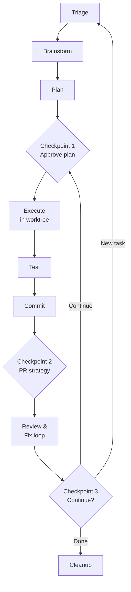

# Work Cycle

A Claude Code plugin for structured **Plan-Do-Review-Renew** development workflows.

Every task follows the same cycle — triage, brainstorm the design, plan, execute in isolation, test, review, ship, and decide what's next. Even small tasks get a quick assumption check before diving in. Explicit checkpoints keep you in control.

## Install

Add the marketplace and install the plugin from within Claude Code:

```
/plugin marketplace add ANaka/work-cycle
/plugin install work-cycle@work-cycle
```

Or browse available plugins interactively with `/plugin` after adding the marketplace.

To pick up changes without restarting, run `/reload-plugins`.

## What's in it

### Skills (auto-invoked by Claude)

- **plan-do-review-renew** — Full cycle with explicit checkpoints: triage, brainstorm (assumption check for small tasks, full design exploration for larger ones), plan (via `/omc-plan`), execute (in isolated worktree), test, commit, PR, and merge. Inspired by [superpowers](https://github.com/obra/superpowers) brainstorming philosophy — examine assumptions before committing to an approach.
- **pr-review-fix** — Review an open PR, fix issues directly in the worktree, push fixes, and comment with a structured summary.

### Commands (user-invoked)

| Command | Description |
|---------|-------------|
| `/work-cycle:plan-execute-review-renew` | Invoke the plan-do-review-renew skill |
| `/work-cycle:review-pr` | Invoke pr-review-fix on a PR |
| `/work-cycle:peer-plan-review` | Delegate plan review to an external model (Gemini, Codex, Cursor, or Claude) |
| `/work-cycle:peer-pr-review` | Delegate PR review to an external model (Gemini, Codex, Cursor, or Claude) |

### The Cycle



## Dependencies

- [Claude Code](https://docs.anthropic.com/en/docs/claude-code) CLI
- `gh` CLI (for PR operations)
- `git` with worktree support
- `tmux` (for `/peer-pr-review` and `/peer-plan-review` worker spawning)
- [oh-my-claudecode](https://github.com/anthropics/oh-my-claudecode) (for `/omc-plan` and `/team` referenced in the skills)
