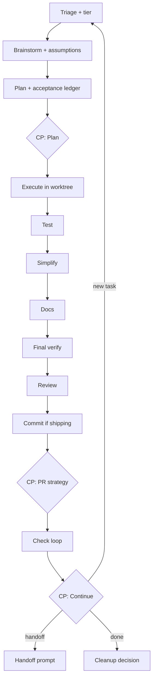

# Work Cycle

Work Cycle is a Claude Code plugin today, and a growing reference library for
agentic programming workflows.

The current stable implementation is still the Claude plugin at the repository
root: `.claude-plugin/`, `skills/`, and `commands/`. Those paths stay in place
for compatibility. The new `library/`, `profiles/`, `adapters/`, and `docs/`
folders describe the portable workflow model and the path toward Codex, Cursor,
and standalone usage.

## Current Claude Install

Add the marketplace and install the plugin from within Claude Code:

```text
/plugin marketplace add ANaka/work-cycle
/plugin install work-cycle@work-cycle
```

Or browse available plugins interactively with `/plugin` after adding the
marketplace.

To pick up changes without restarting, run `/reload-plugins`.

## Repository Layout

```text
.claude-plugin/              Claude Code marketplace metadata
commands/                    Current Claude command entrypoints
skills/                      Current Claude skills
library/                     Portable workflow reference model
profiles/                    Dependency and runtime profiles
adapters/                    Agent-specific translation notes
docs/                        Authoring, migration, notices, roadmap
```

The `library/` files define the durable workflow semantics: worktree isolation,
verification tiers, checkpoints, debugging gates, acceptance criteria, PR loops,
and handoff behavior. They are a reference model, not yet an automated generator
for the root Claude files.

## What Is In It

### Current Claude Skills

- **plan-do-review-renew** - Full cycle with explicit checkpoints and
  cross-cutting gates: triage, brainstorm, plan, isolated worktree execution,
  tests, simplify pass, doc check, final verification, commit, PR strategy,
  check loop, and continuation decision.
- **pr-review-fix** - Review an open PR, fix issues directly in the worktree,
  push fixes, and comment with a structured summary. Also responds to the
  `fixpr` shorthand.

### Current Claude Commands

| Command | Description |
| --- | --- |
| `/work-cycle:plan-execute-review-renew` | Invoke the plan-do-review-renew skill |
| `/work-cycle:review-pr` | Invoke pr-review-fix on a PR |
| `/work-cycle:peer-plan-review` | Delegate plan review to an external model worker |
| `/work-cycle:peer-pr-review` | Delegate PR review to an external model worker |

### Portable Library

- [Library overview](library/README.md)
- [Plan-Do-Review-Renew](library/workflows/plan-do-review-renew.md)
- [PR Review Fix](library/workflows/pr-review-fix.md)
- [Peer Review](library/workflows/peer-review.md)
- [Verification Tiers](library/concepts/verification-tiers.md)
- [Debugging Gate](library/concepts/debugging-gate.md)
- [Worktree Isolation](library/concepts/worktrees.md)
- [Acceptance Ledger](library/concepts/acceptance-ledger.md)
- [Checkpoints](library/concepts/checkpoints.md)
- [Handoff](library/concepts/handoff.md)

## Profiles

Profiles define how much external runtime support a workflow may assume.

- [Standalone](profiles/standalone.md) - self-contained workflow contracts.
- [Superpowers Integrated](profiles/superpowers-integrated.md) - delegates
  generic software-engineering gates to installed Superpowers skills where the
  host agent supports them.
- [OMC Optional](profiles/omc-optional.md) - uses oh-my-claudecode when present
  but keeps Work Cycle semantics outside the OMC runtime.

Superpowers is a good dependency for workflow discipline when it is available.
It should help execute phases; it should not replace the Work Cycle state
machine. OMC is best treated as an optional orchestration/runtime layer, not a
required foundation for every adapter.

## Adapters

- [Claude Code](adapters/claude-code/README.md) - current stable implementation.
- [Codex](adapters/codex/README.md) - planned translation target using Codex
  skills, `update_plan`, worktrees, GitHub tooling, and subagents where
  authorized.
- [Cursor](adapters/cursor/README.md) - planned translation target using rules
  and paste-ready prompts, not one-to-one slash command parity.

Codex and Cursor adapter docs are intentionally descriptive in this slice. They
do not claim installable adapter parity yet.

## Dependencies

The root Claude plugin currently expects:

- Claude Code
- `git` with worktree support
- `gh` for PR and issue operations
- `tmux` for peer worker commands
- oh-my-claudecode surfaces used by the Claude workflow, including `/omc-plan`,
  notepad/state primitives, `/team`, and the slop-cleaner skill
- Superpowers when the Claude workflow invokes installed Superpowers skills for
  multi-session brainstorming and related gates

Portable library docs should not assume those Claude-only primitives. Adapter
docs translate the workflow to each host.

## Development Docs

- [Migration plan](docs/migration.md)
- [Authoring guide](docs/authoring.md)
- [Third-party notices](docs/third-party-notices.md)
- [Skill backlog](docs/skill-backlog.md)

## The Cycle


```mermaid
graph TD
    A[Triage + tier] --> B[Brainstorm + assumptions]
    B --> C[Plan + acceptance ledger]
    C --> D{CP: Plan}
    D --> E[Execute in worktree]
    E --> F[Test]
    F --> G[Simplify]
    G --> H[Docs]
    H --> I[Final verify]
    I --> J[Review]
    J --> K[Commit if shipping]
    K --> L{CP: PR strategy}
    L --> M[Check loop]
    M --> N{CP: Continue}
    N -->|new task| A
    N -->|handoff| O[Handoff prompt]
    N -->|done| P[Cleanup decision]
```

Cross-cutting throughout: verification tiers, debugging gate, worktree safety,
acceptance criteria, and explicit continuation decisions.
