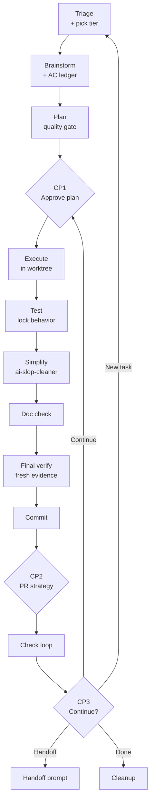

# Work Cycle

A Claude Code plugin for structured **Plan-Do-Review-Renew** development workflows.

Every task follows the same cycle — triage, brainstorm the design, plan, execute in isolation, test, review, ship, and decide what's next. Even small tasks get a quick assumption check before diving in. Explicit checkpoints keep you in control.

## Install

Add the marketplace and install the plugin from within Claude Code:

```
/plugin marketplace add ANaka/work-cycle
/plugin install work-cycle@work-cycle
```

Or browse available plugins interactively with `/plugin` after adding the marketplace.

To pick up changes without restarting, run `/reload-plugins`.

## What's in it

### Skills (auto-invoked by Claude)

- **plan-do-review-renew** — Full cycle with explicit checkpoints and cross-cutting gates: triage with verification-tier selection, brainstorm (with `superpowers:brainstorming` invoked at Multi-session for HARD-GATE spec discipline; principles adopted inline at smaller tiers), acceptance-criteria ledger, plan (via `/omc-plan`) under a quality gate that absorbs `superpowers:writing-plans` rigor (bite-size tasks, exact paths, code-in-steps, type consistency), execute in isolated worktree, test, simplify (via `/oh-my-claudecode:ai-slop-cleaner`), doc check, final verify, commit, PR, merge. Includes a Debugging Gate (3-attempt cap with root-cause hypothesis required) and auto-suggests handoff prompts when context tightens or sessions break. All artifacts live under `.omc/` (specs in `.omc/plans/specs/`, plans in `.omc/plans/`) — no second tree.
- **pr-review-fix** — Review an open PR, fix issues directly in the worktree, push fixes, and comment with a structured summary. Also responds to the `fixpr` shorthand.

### Commands (user-invoked)

| Command | Description |
|---------|-------------|
| `/work-cycle:plan-execute-review-renew` | Invoke the plan-do-review-renew skill |
| `/work-cycle:review-pr` | Invoke pr-review-fix on a PR |
| `/work-cycle:peer-plan-review` | Delegate plan review to an external model (Gemini, Codex, Cursor, or Claude) |
| `/work-cycle:peer-pr-review` | Delegate PR review to an external model (Gemini, Codex, Cursor, or Claude) |

### The Cycle


```mermaid
graph TD
    A[Triage<br/>+ pick tier] --> B[Brainstorm<br/>+ AC ledger]
    B --> C[Plan<br/>quality gate]
    C --> D{CP1<br/>Approve plan}
    D --> E[Execute<br/>in worktree]
    E --> F[Test<br/>lock behavior]
    F --> G[Simplify<br/>ai-slop-cleaner]
    G --> H[Doc check]
    H --> I[Final verify<br/>fresh evidence]
    I --> J[Commit]
    J --> K{CP2<br/>PR strategy}
    K --> L[Check loop]
    L --> M{CP3<br/>Continue?}
    M -->|New task| A
    M -->|Continue| D
    M -->|Handoff| N[Handoff prompt]
    M -->|Done| O[Cleanup]
```

Cross-cutting throughout: **Verification Tiers** (Light/Standard/Thorough — auth/secrets/schemas never downgrade) and the **Debugging Gate** (3-attempt cap, root-cause hypothesis required before each fix).

## Dependencies

- [Claude Code](https://docs.anthropic.com/en/docs/claude-code) CLI
- `gh` CLI (for PR operations)
- `git` with worktree support
- `tmux` (for `/peer-pr-review` and `/peer-plan-review` worker spawning)
- [oh-my-claudecode](https://github.com/anthropics/oh-my-claudecode) (for `/omc-plan`, `/team`, and `/oh-my-claudecode:ai-slop-cleaner` referenced in the skills)
- [superpowers](https://github.com/obra/superpowers) (for `superpowers:brainstorming` invoked at Multi-session, with spec output redirected to `.omc/plans/specs/`)
